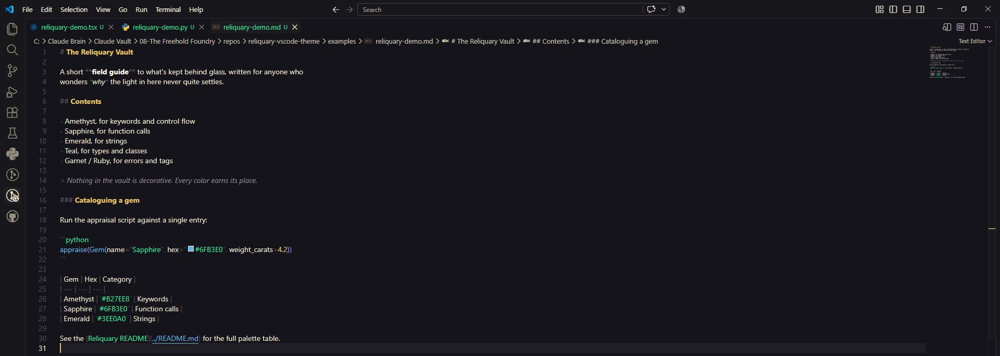
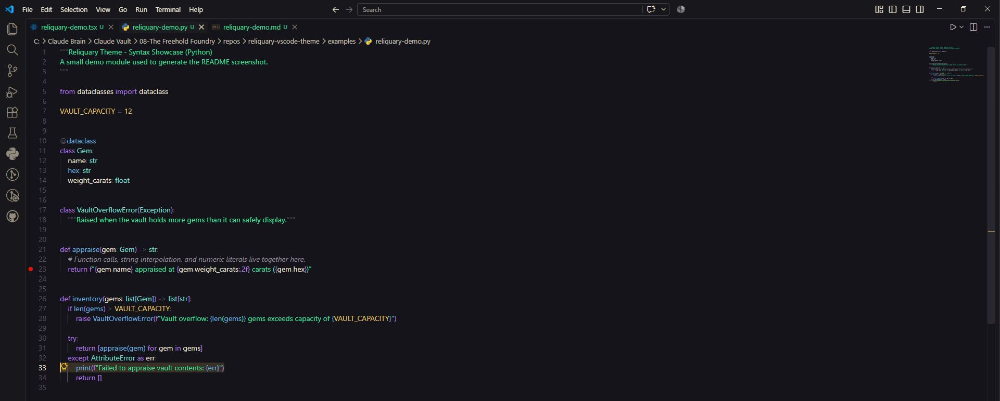
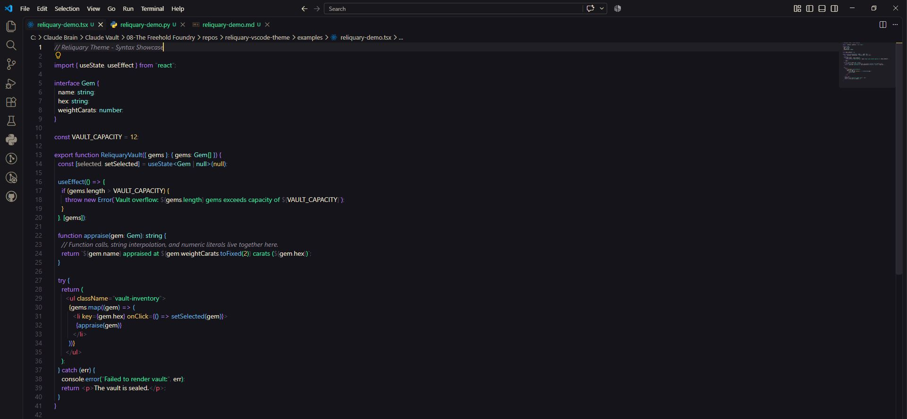

# Reliquary

A VS Code color theme built around one idea: syntax highlighting reads better with several accents live on screen at once.

A luxurious assortment of jewel tones, amethyst, sapphire, emerald, teal, and ruby, glows against a rich graphite and ink background, with warm gold marking every place your eye should land.

Reliquary Light carries the same richness onto a warm parchment surface, trading ink and graphite for cream and soft neutrals without losing any of the color.

## Why Reliquary exists

Most dark themes on the Marketplace pick a single accent color, one blue or one purple, and lean on it everywhere. Reliquary gives keywords, function calls, strings, types, and errors each their own jewel tone: amethyst, sapphire, emerald, teal, ruby. A file's structure is visible at a glance instead of blurring into one color. Gold/brass is the one color reserved for *interaction*: selection, cursor, the active-tab underline, the status bar. It stays a clear signal instead of competing with the syntax colors.

Reliquary shares its palette with the matching terminal prompt and Oh My Posh schemes, so a shell opened inside VS Code's integrated terminal and an external terminal window read as the same visual world.

| Markdown | Python | TSX |
|---|---|---|
|  |  |  |

## What's included

- **Reliquary** is the dark theme: black/graphite chrome, cream text, jewel-tone syntax and terminal colors.
- **Reliquary Light** is a light variant of the same palette. Each jewel tone reuses its dark-mode hex as its light-mode text color rather than inventing new ones, so the two themes stay related. The integrated terminal panel stays dark in both themes: most people run a dark terminal regardless of editor theme, and Reliquary Light doesn't force one on you.

## Install

Reliquary isn't published to the VS Code Marketplace yet, but it installs from source in under a minute.

**Prerequisites:** VS Code 1.70 or later, and Node.js installed (only needed for the `npx` packaging step below; the theme itself has no runtime dependencies).

```bash
git clone https://github.com/Freehold-Foundry/reliquary-vscode-theme.git
cd reliquary-vscode-theme
npx --yes @vscode/vsce package --allow-missing-repository
code --install-extension reliquary-theme-0.2.0.vsix
```

> Copying this folder straight into `.vscode/extensions` will *not* register it. VS Code's extension picker reads from its own `extensions.json` manifest, and only the real install pipeline above writes to that file.

Then reload the window (`Developer: Reload Window` from the Command Palette, or just restart VS Code), open the Command Palette again, and run `Preferences: Color Theme` → choose **Reliquary** or **Reliquary Light**.

## Palette

All hex values trace back to the Freehold Foundry's shared Master Palette. Every "bright" value below is what shows up in the dark theme's syntax tokens and terminal; the muted/dark value backs UI chrome and darker surfaces.

| Role | Dark / muted | Bright | Used for |
|---|---|---|---|
| Ground (editor background) | `#14141A` | — | Editor background |
| Chrome (sidebar, status bar, panels) | `#18181C` | — | UI surfaces |
| Text | `#F0E6D6` | `#FFF8EC` | Body text, emphasis |
| **Gold, the UI accent** | `#C9A24B` | `#E8C468` | Selection, cursor, active-tab underline, status bar |
| Amethyst | `#3D1E5C` | `#B27EE8` | Keywords, control flow |
| Sapphire | `#1B3A66` | `#6FB3E0` | Function/method calls |
| Emerald | `#164D34` | `#3EE0A0` | Strings, git added/untracked |
| Garnet / Ruby | `#5C1A2E` | `#E45D75` | Errors, tags, git deleted/conflicted |
| Teal | `#1C5C56` | `#7FE0D6` | Types, classes |

The same palette drives the 16-color integrated-terminal palette and bracket-pair colorization (amethyst → sapphire → emerald → gold), which is where "several jewel tones visible at once" shows up hardest in ordinary code.

## Structure

```
reliquary-vscode-theme/
  package.json                        extension manifest, registers both themes
  themes/
    reliquary-color-theme.json        dark theme: color + syntax token definitions
    reliquary-light-color-theme.json  light theme: same structure, light-mode values
  examples/                           demo source files used for the screenshots above
  screenshots/                        theme screenshots embedded in this README
  LICENSE                             Apache 2.0, modified by the Commons Clause
  README.md
```

## Contributing

Issues and pull requests are welcome. This is a small, self-contained extension, so most changes are a matter of editing the two theme JSON files under `themes/` and repackaging with `vsce package`.

## License

Free and source-available — not OSI-approved open source. Licensed under Apache 2.0, modified by the Commons Clause: you can read, use, and modify this theme freely; the Commons Clause condition restricts reselling the software itself. See [`LICENSE`](./LICENSE) for the full text.

---

Reliquary is the first published output of **[The Freehold Foundry](https://github.com/Freehold-Foundry)**, a free and source-available initiative.
